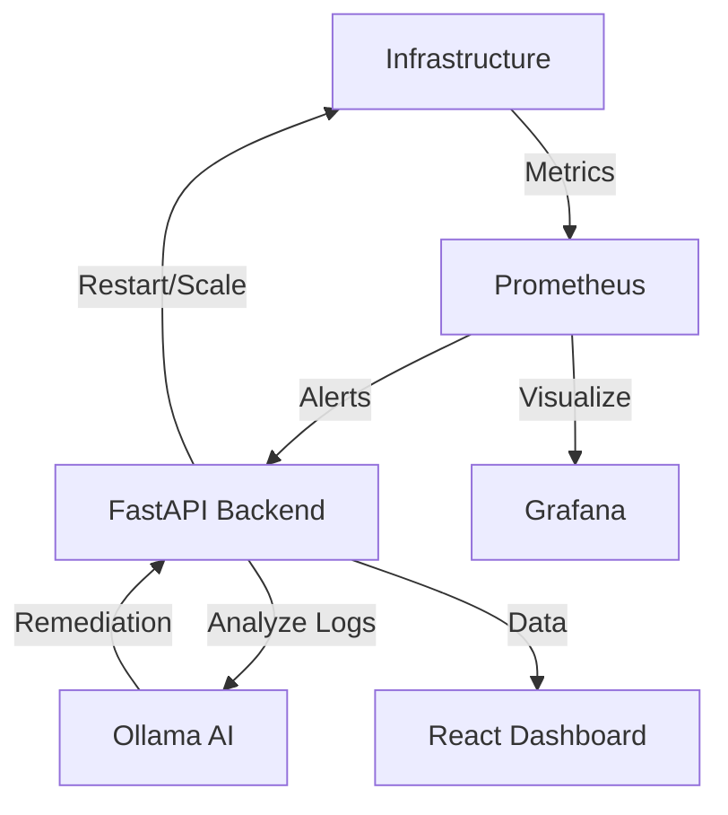

# AutoOps AI – Self-Healing DevOps Platform

AutoOps AI is an intelligent DevOps observability and automation platform that leverages local LLMs (Ollama) to analyze logs and automatically heal infrastructure.

## 🚀 Features

- **🔍 Real-Time Monitoring**: Full visibility via Prometheus metrics and Grafana dashboards.
- **🤖 AI Log Analyzer**: Integrated Ollama (Llama3/Mistral) for root cause analysis and remediation suggestions.
- **⚡ Self-Healing Engine**: Automated container restarts and health orchestration via Docker SDK.
- **📊 DevOps Dashboard**: Premium React-based UI for real-time observability.
- **🚀 CI/CD Ready**: Integrated GitHub Actions for automated deployment.

## 🏗️ Architecture



## 🛠️ Tech Stack

- **Backend**: Python (FastAPI), Docker SDK
- **AI**: Ollama (llama3)
- **Monitoring**: Prometheus, Node Exporter, Grafana
- **Frontend**: React (Vite, TypeScript), Recharts, Tailwind-style CSS
- **Orchestration**: Docker Compose

## 🚦 Getting Started

### Prerequisites
- Docker & Docker Compose
- 8GB+ RAM (for local AI models)

### Setup & Run

1. **Clone the repository** (or use the generated files).
2. **Start the stack**:
   ```bash
   docker-compose up -d
   ```
3. **Pull the AI Model**:
   AutoOps uses Llama3 by default. Run this command to prepare the AI engine:
   ```bash
   docker exec -it autoops-ollama ollama pull llama3
   ```
4. **Access the Platform**:
   - **Dashboard**: [http://localhost:5173](http://localhost:5173)
   - **Backend API**: [http://localhost:8000/docs](http://localhost:8000/docs)
   - **Prometheus**: [http://localhost:9090](http://localhost:9090)
   - **Grafana**: [http://localhost:3000](http://localhost:3000) (User/Pass: admin/admin)

## 🛡️ Self-Healing in Action

If a managed service goes down, Prometheus detects the failure and sends an alert to the AutoOps backend. The backend then:
1. Identifies the container.
2. Triggers a restart.
3. Logs the action in the Healing History dashboard.

## 🤖 AI Log Analysis

Paste any log snippet into the **AI Log Analyzer** on the dashboard. The platform will query the local Ollama instance to provide:
- **Root Cause**: What exactly went wrong.
- **Suggestion**: Actionable steps to fix it.
- **Severity**: Criticality of the issue.

---
## 👤 Contact

**Sachin CS**  
*DevSecOps Engineer*  
📧 [cssachin83@gmail.com](mailto:cssachin83@gmail.com)  
📞 +91 8496001030
